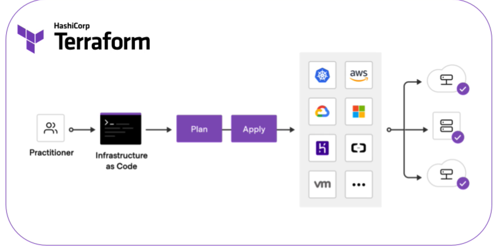
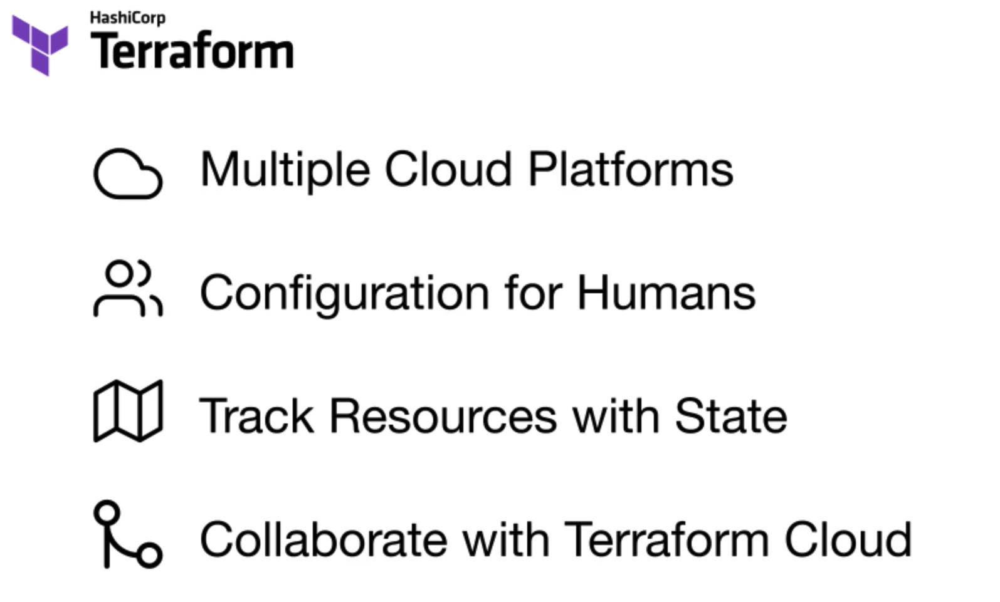
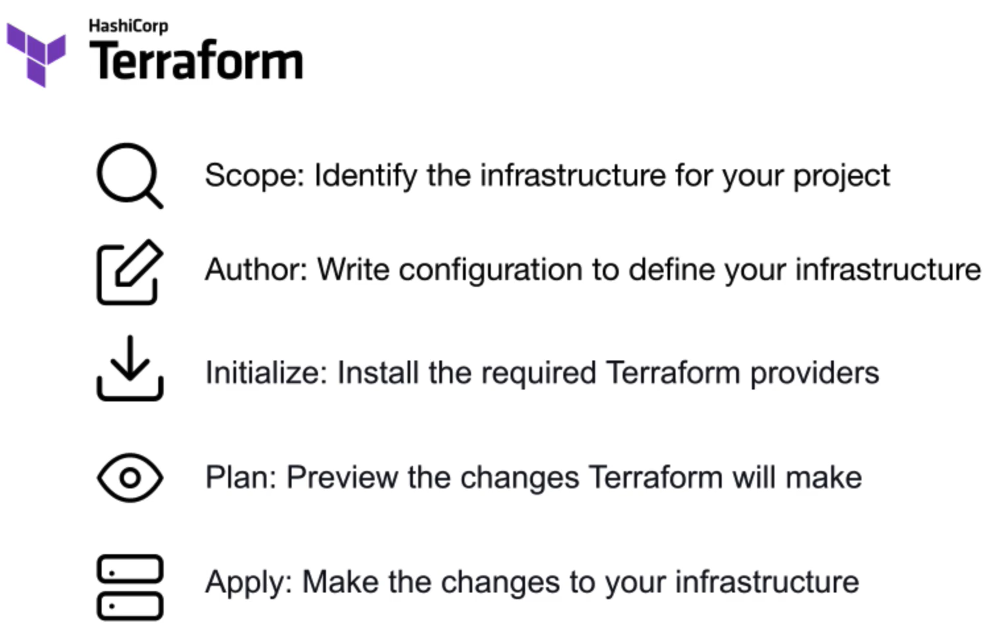

open windows power shell in administrator mode 

> Get-ExecutionPolicy

Set-ExecutionPolicy Bypass -Scope Process -Force

`choco install terraform`

`choco install terraform`

`terraform -v`
 terraform -v
Terraform v1.13.4
on windows_amd64
PS C:\WINDOWS\system32> Set-ExecutionPolicy Bypass -Scope Process -Force; `
>> [System.Net.ServicePointManager]::SecurityProtocol = `
>> [System.Net.ServicePointManager]::SecurityProtocol -bor 3072; `
>> iex ((New-Object System.Net.WebClient).DownloadString('https://community.chocolatey.org/install.ps1'))
